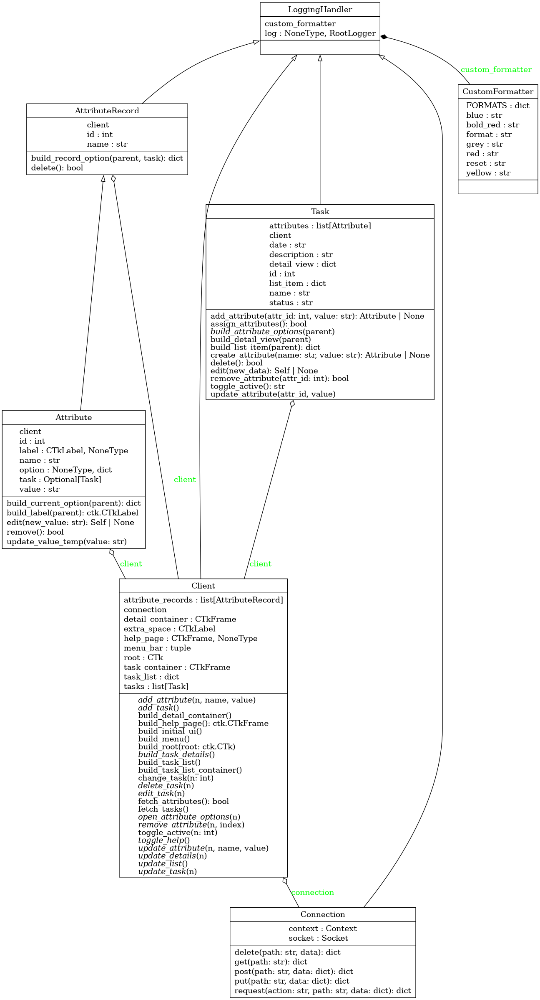

# To-Do App

This is a simple to-do app that allows you to add, delete, and mark tasks as complete. 
It is built using Python and [CustomTkinter](https://customtkinter.tomschimansky.com/). 

At this point in the project, scrolling via the scrollwheel may only work on Linux, due to how TKinter implements the button events differently on Linux/MacOS and Windows. 
You can still scroll via the scrollbars that show on screen.

## Structure

This app is divided into one main service, and 4 other microservices. 
All communication is done using [ZeroMQ](https://zeromq.org/).

### Main Service

This is the UI of the app, and it is built using CustomTkinter. 
It is responsible for displaying the tasks, and handling user input.
It is built using a system of classes to manage the data and UI effectively.
For my own convenience when coding, I am using a pycharm plugin called 
[BetterHighlights](https://plugins.jetbrains.com/plugin/12895-better-highlights/how-to-use-linking), that allows me to link between comments. 

Specifically, I used this to link between different commented diagrams of the layout of different TKinter components, as you can see below the `Client.build_initial_ui()`

```py
def build_initial_ui(self):
    """TODO:Build containers, task list, details, and help page"""
    # tkLayout
    #  root
    #  > menu_bar [[menu_bar]]
    #  > task_container [[task_container]]
    #  > detail_container [[detail_container]]

# ... Later in the  Client class

def build_task_list_container(self): # Client.build_task_list_container
    # tkLayout
    #  task_container #[[task_container]]
    #  > left_canvas
    #    > task_list_container
    #      > button[] [[button]]
    #  > left_scrollbar
        
# ... In the Task class

def build_list_item(self, parent) -> dict: # Task.build_list_item
    # tkLayout
    #  button #[[button]]
    #  > name
    #  > filler
    #  > attributes
```

#### Class Diagram

Below is a class diagram of the main service, showing the different classes and their relationships.



### Microservice A

This was built by a teammate, and was made to generate different themes that can be used for the app.
It is made using Node.js.

### Microservice B

This is the server for the app, and where all the data is stored. 
It has a crude version of https requests implemented, tailored to the purposes of the app.

### Microservice C

This microservice allows you to filter and sort different tasks based on their properties.

### Microservice D

This microservice is responsible for sending notifications to the user when a task is due.
